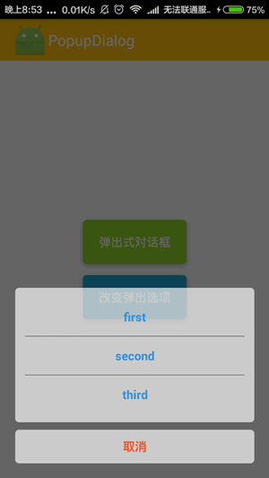
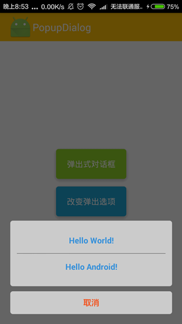
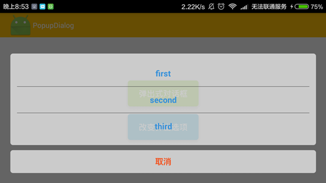
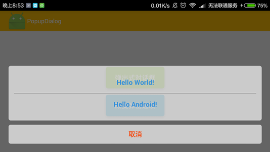

#PopupDialog

PopupDialog是一个仿iOS的popup对话框，有兴趣的可以下载用

项目中提供了一个sample样例供参考

##运行截图

* 

* 

* 

* 

* 

##使用方法

1. 将项目中的library导入你所在的工程里
2. 在代码中应用，如下所示：

```
// 先声明dialog（可在当前activity通用）
private PopupDailog dialog;
...
// 初始化对话框的数据
List<String> mData = new ArrayList<>();
mData.add("first");
mData.add("second");
mData.add("third");
mData.add("four");
mData.add("five");
...
// 初始化dialog
dialog = new PopupDialog(context, mData);
// 设置dialog中item的点击事件监听
dialog.setOnItemClickListener(new PopupDialog.OnItemClickListener() {
            @Override
            public void onItemClick(View v, int position) {
                ...
            }
        });
// 使用
dialog.show();
// 关闭
dialog.dismiss();
```

##有问题反馈
在使用中有任何问题，欢迎反馈给我，可以用以下联系方式跟我交流

* 邮箱: cjlmonster@163.com